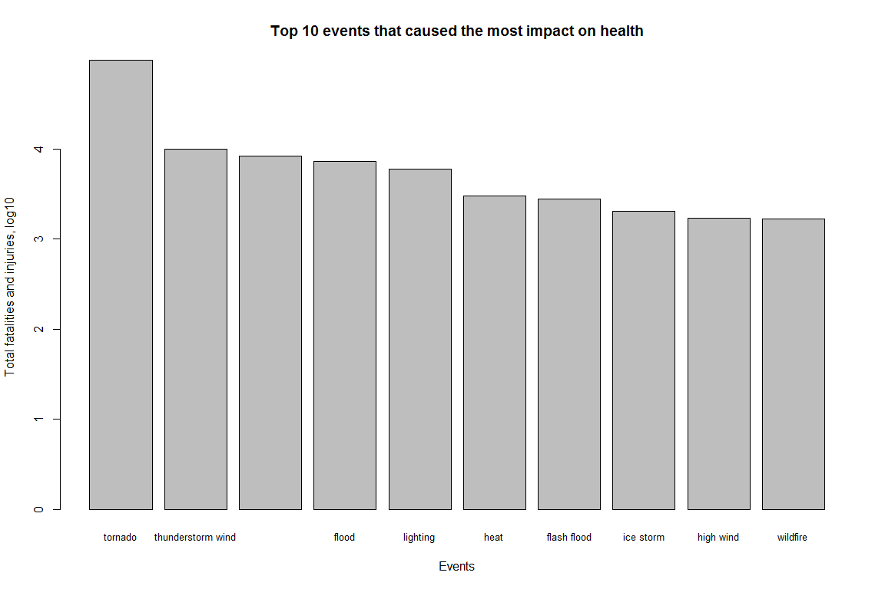
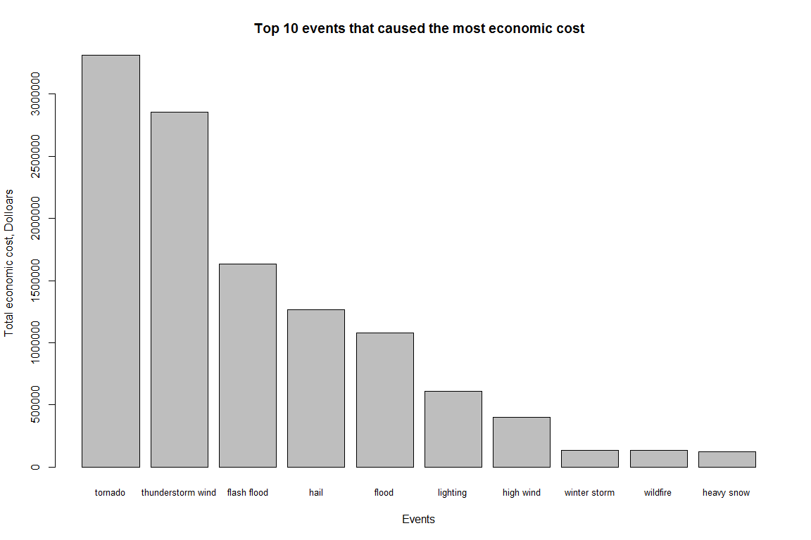

Project 2: Explore US NOAA Storm database
================
Zhenning Tan
September 17, 2016

Introduction
------------

Storms and other severe weather events can cause both public health and economic problems for communities and municipalities. Many severe events can result in fatalities, injuries, and property damage, and preventing such outcomes to the extent possible is a key concern.

This project involves exploring the U.S. National Oceanic and Atmospheric Administration's (NOAA) storm database. This database tracks characteristics of major storms and weather events in the United States, including when and where they occur, as well as estimates of any fatalities, injuries, and property damage.

### Synopsis

In this project, I analyzed the storm database and found the most severe weather conditions that cause the most damage on population health and economics. Tornado, thunderstorm wind, excessive heat, flood and lighting are the top 5 conditions that caused population fatality and injury. Especially, tornados caused almost 100 thousand fatalities and injuries Tornados, thunderstorm wind, flash flood, hail and flood are the top 5 conditions for economic damage, causing at least 1 million dollar loss. The severe weather conditions which impact great population health usually cause great economic loss as well.

### Data Processing

``` r
knitr::opts_chunk$set(fig.width=12, fig.height=8, warning=FALSE, message=FALSE)
```

Download and read in data file

``` r
if(!file.exists("StormData.csv")){
  fileurl <- "https://d396qusza40orc.cloudfront.net/repdata%2Fdata%2FStormData.csv.bz2"
  download.file(fileurl, destfile = "StormData.csv")
}

df <- read.csv("StormData.csv")
dim(df)
```

    ## [1] 902297     37

``` r
head(df)
```

    ##   STATE__           BGN_DATE BGN_TIME TIME_ZONE COUNTY COUNTYNAME STATE
    ## 1       1  4/18/1950 0:00:00     0130       CST     97     MOBILE    AL
    ## 2       1  4/18/1950 0:00:00     0145       CST      3    BALDWIN    AL
    ## 3       1  2/20/1951 0:00:00     1600       CST     57    FAYETTE    AL
    ## 4       1   6/8/1951 0:00:00     0900       CST     89    MADISON    AL
    ## 5       1 11/15/1951 0:00:00     1500       CST     43    CULLMAN    AL
    ## 6       1 11/15/1951 0:00:00     2000       CST     77 LAUDERDALE    AL
    ##    EVTYPE BGN_RANGE BGN_AZI BGN_LOCATI END_DATE END_TIME COUNTY_END
    ## 1 TORNADO         0                                               0
    ## 2 TORNADO         0                                               0
    ## 3 TORNADO         0                                               0
    ## 4 TORNADO         0                                               0
    ## 5 TORNADO         0                                               0
    ## 6 TORNADO         0                                               0
    ##   COUNTYENDN END_RANGE END_AZI END_LOCATI LENGTH WIDTH F MAG FATALITIES
    ## 1         NA         0                      14.0   100 3   0          0
    ## 2         NA         0                       2.0   150 2   0          0
    ## 3         NA         0                       0.1   123 2   0          0
    ## 4         NA         0                       0.0   100 2   0          0
    ## 5         NA         0                       0.0   150 2   0          0
    ## 6         NA         0                       1.5   177 2   0          0
    ##   INJURIES PROPDMG PROPDMGEXP CROPDMG CROPDMGEXP WFO STATEOFFIC ZONENAMES
    ## 1       15    25.0          K       0                                    
    ## 2        0     2.5          K       0                                    
    ## 3        2    25.0          K       0                                    
    ## 4        2     2.5          K       0                                    
    ## 5        2     2.5          K       0                                    
    ## 6        6     2.5          K       0                                    
    ##   LATITUDE LONGITUDE LATITUDE_E LONGITUDE_ REMARKS REFNUM
    ## 1     3040      8812       3051       8806              1
    ## 2     3042      8755          0          0              2
    ## 3     3340      8742          0          0              3
    ## 4     3458      8626          0          0              4
    ## 5     3412      8642          0          0              5
    ## 6     3450      8748          0          0              6

``` r
str(df)
```

    ## 'data.frame':    902297 obs. of  37 variables:
    ##  $ STATE__   : num  1 1 1 1 1 1 1 1 1 1 ...
    ##  $ BGN_DATE  : Factor w/ 16335 levels "1/1/1966 0:00:00",..: 6523 6523 4242 11116 2224 2224 2260 383 3980 3980 ...
    ##  $ BGN_TIME  : Factor w/ 3608 levels "00:00:00 AM",..: 272 287 2705 1683 2584 3186 242 1683 3186 3186 ...
    ##  $ TIME_ZONE : Factor w/ 22 levels "ADT","AKS","AST",..: 7 7 7 7 7 7 7 7 7 7 ...
    ##  $ COUNTY    : num  97 3 57 89 43 77 9 123 125 57 ...
    ##  $ COUNTYNAME: Factor w/ 29601 levels "","5NM E OF MACKINAC BRIDGE TO PRESQUE ISLE LT MI",..: 13513 1873 4598 10592 4372 10094 1973 23873 24418 4598 ...
    ##  $ STATE     : Factor w/ 72 levels "AK","AL","AM",..: 2 2 2 2 2 2 2 2 2 2 ...
    ##  $ EVTYPE    : Factor w/ 985 levels "   HIGH SURF ADVISORY",..: 834 834 834 834 834 834 834 834 834 834 ...
    ##  $ BGN_RANGE : num  0 0 0 0 0 0 0 0 0 0 ...
    ##  $ BGN_AZI   : Factor w/ 35 levels "","  N"," NW",..: 1 1 1 1 1 1 1 1 1 1 ...
    ##  $ BGN_LOCATI: Factor w/ 54429 levels "","- 1 N Albion",..: 1 1 1 1 1 1 1 1 1 1 ...
    ##  $ END_DATE  : Factor w/ 6663 levels "","1/1/1993 0:00:00",..: 1 1 1 1 1 1 1 1 1 1 ...
    ##  $ END_TIME  : Factor w/ 3647 levels ""," 0900CST",..: 1 1 1 1 1 1 1 1 1 1 ...
    ##  $ COUNTY_END: num  0 0 0 0 0 0 0 0 0 0 ...
    ##  $ COUNTYENDN: logi  NA NA NA NA NA NA ...
    ##  $ END_RANGE : num  0 0 0 0 0 0 0 0 0 0 ...
    ##  $ END_AZI   : Factor w/ 24 levels "","E","ENE","ESE",..: 1 1 1 1 1 1 1 1 1 1 ...
    ##  $ END_LOCATI: Factor w/ 34506 levels "","- .5 NNW",..: 1 1 1 1 1 1 1 1 1 1 ...
    ##  $ LENGTH    : num  14 2 0.1 0 0 1.5 1.5 0 3.3 2.3 ...
    ##  $ WIDTH     : num  100 150 123 100 150 177 33 33 100 100 ...
    ##  $ F         : int  3 2 2 2 2 2 2 1 3 3 ...
    ##  $ MAG       : num  0 0 0 0 0 0 0 0 0 0 ...
    ##  $ FATALITIES: num  0 0 0 0 0 0 0 0 1 0 ...
    ##  $ INJURIES  : num  15 0 2 2 2 6 1 0 14 0 ...
    ##  $ PROPDMG   : num  25 2.5 25 2.5 2.5 2.5 2.5 2.5 25 25 ...
    ##  $ PROPDMGEXP: Factor w/ 19 levels "","-","?","+",..: 17 17 17 17 17 17 17 17 17 17 ...
    ##  $ CROPDMG   : num  0 0 0 0 0 0 0 0 0 0 ...
    ##  $ CROPDMGEXP: Factor w/ 9 levels "","?","0","2",..: 1 1 1 1 1 1 1 1 1 1 ...
    ##  $ WFO       : Factor w/ 542 levels ""," CI","$AC",..: 1 1 1 1 1 1 1 1 1 1 ...
    ##  $ STATEOFFIC: Factor w/ 250 levels "","ALABAMA, Central",..: 1 1 1 1 1 1 1 1 1 1 ...
    ##  $ ZONENAMES : Factor w/ 25112 levels "","                                                                                                                               "| __truncated__,..: 1 1 1 1 1 1 1 1 1 1 ...
    ##  $ LATITUDE  : num  3040 3042 3340 3458 3412 ...
    ##  $ LONGITUDE : num  8812 8755 8742 8626 8642 ...
    ##  $ LATITUDE_E: num  3051 0 0 0 0 ...
    ##  $ LONGITUDE_: num  8806 0 0 0 0 ...
    ##  $ REMARKS   : Factor w/ 436781 levels "","-2 at Deer Park\n",..: 1 1 1 1 1 1 1 1 1 1 ...
    ##  $ REFNUM    : num  1 2 3 4 5 6 7 8 9 10 ...

``` r
#check what types of events are there
sort(unique(df$EVTYPE))
```

    ##   [1]    HIGH SURF ADVISORY           COASTAL FLOOD                
    ##   [3]  FLASH FLOOD                    LIGHTNING                    
    ##   [5]  TSTM WIND                      TSTM WIND (G45)              
    ##   [7]  WATERSPOUT                     WIND                         
    ##   [9] ?                              ABNORMAL WARMTH               
    ##  [11] ABNORMALLY DRY                 ABNORMALLY WET                
    ##  [13] ACCUMULATED SNOWFALL           AGRICULTURAL FREEZE           
    ##  [15] APACHE COUNTY                  ASTRONOMICAL HIGH TIDE        
    ##  [17] ASTRONOMICAL LOW TIDE          AVALANCE                      
    ##  [19] AVALANCHE                      BEACH EROSIN                  
    ##  [21] Beach Erosion                  BEACH EROSION                 
    ##  [23] BEACH EROSION/COASTAL FLOOD    BEACH FLOOD                   
    ##  [25] BELOW NORMAL PRECIPITATION     BITTER WIND CHILL             
    ##  [27] BITTER WIND CHILL TEMPERATURES Black Ice                     
    ##  [29] BLACK ICE                      BLIZZARD                      
    ##  [31] BLIZZARD AND EXTREME WIND CHIL BLIZZARD AND HEAVY SNOW       
    ##  [33] Blizzard Summary               BLIZZARD WEATHER              
    ##  [35] BLIZZARD/FREEZING RAIN         BLIZZARD/HEAVY SNOW           
    ##  [37] BLIZZARD/HIGH WIND             BLIZZARD/WINTER STORM         
    ##  [39] BLOW-OUT TIDE                  BLOW-OUT TIDES                
    ##  [41] BLOWING DUST                   blowing snow                  
    ##  [43] Blowing Snow                   BLOWING SNOW                  
    ##  [45] BLOWING SNOW- EXTREME WIND CHI BLOWING SNOW & EXTREME WIND CH
    ##  [47] BLOWING SNOW/EXTREME WIND CHIL BREAKUP FLOODING              
    ##  [49] BRUSH FIRE                     BRUSH FIRES                   
    ##  [51] COASTAL  FLOODING/EROSION      COASTAL EROSION               
    ##  [53] Coastal Flood                  COASTAL FLOOD                 
    ##  [55] coastal flooding               Coastal Flooding              
    ##  [57] COASTAL FLOODING               COASTAL FLOODING/EROSION      
    ##  [59] Coastal Storm                  COASTAL STORM                 
    ##  [61] COASTAL SURGE                  COASTAL/TIDAL FLOOD           
    ##  [63] COASTALFLOOD                   COASTALSTORM                  
    ##  [65] Cold                           COLD                          
    ##  [67] COLD AIR FUNNEL                COLD AIR FUNNELS              
    ##  [69] COLD AIR TORNADO               Cold and Frost                
    ##  [71] COLD AND FROST                 COLD AND SNOW                 
    ##  [73] COLD AND WET CONDITIONS        Cold Temperature              
    ##  [75] COLD TEMPERATURES              COLD WAVE                     
    ##  [77] COLD WEATHER                   COLD WIND CHILL TEMPERATURES  
    ##  [79] COLD/WIND CHILL                COLD/WINDS                    
    ##  [81] COOL AND WET                   COOL SPELL                    
    ##  [83] CSTL FLOODING/EROSION          DAM BREAK                     
    ##  [85] DAM FAILURE                    Damaging Freeze               
    ##  [87] DAMAGING FREEZE                DEEP HAIL                     
    ##  [89] DENSE FOG                      DENSE SMOKE                   
    ##  [91] DOWNBURST                      DOWNBURST WINDS               
    ##  [93] DRIEST MONTH                   Drifting Snow                 
    ##  [95] DROUGHT                        DROUGHT/EXCESSIVE HEAT        
    ##  [97] DROWNING                       DRY                           
    ##  [99] DRY CONDITIONS                 DRY HOT WEATHER               
    ## [101] DRY MICROBURST                 DRY MICROBURST 50             
    ## [103] DRY MICROBURST 53              DRY MICROBURST 58             
    ## [105] DRY MICROBURST 61              DRY MICROBURST 84             
    ## [107] DRY MICROBURST WINDS           DRY MIRCOBURST WINDS          
    ## [109] DRY PATTERN                    DRY SPELL                     
    ## [111] DRY WEATHER                    DRYNESS                       
    ## [113] DUST DEVEL                     Dust Devil                    
    ## [115] DUST DEVIL                     DUST DEVIL WATERSPOUT         
    ## [117] DUST STORM                     DUST STORM/HIGH WINDS         
    ## [119] DUSTSTORM                      EARLY FREEZE                  
    ## [121] Early Frost                    EARLY FROST                   
    ## [123] EARLY RAIN                     EARLY SNOW                    
    ## [125] Early snowfall                 EARLY SNOWFALL                
    ## [127] Erosion/Cstl Flood             EXCESSIVE                     
    ## [129] Excessive Cold                 EXCESSIVE HEAT                
    ## [131] EXCESSIVE HEAT/DROUGHT         EXCESSIVE PRECIPITATION       
    ## [133] EXCESSIVE RAIN                 EXCESSIVE RAINFALL            
    ## [135] EXCESSIVE SNOW                 EXCESSIVE WETNESS             
    ## [137] EXCESSIVELY DRY                Extended Cold                 
    ## [139] Extreme Cold                   EXTREME COLD                  
    ## [141] EXTREME COLD/WIND CHILL        EXTREME HEAT                  
    ## [143] EXTREME WIND CHILL             EXTREME WIND CHILL/BLOWING SNO
    ## [145] EXTREME WIND CHILLS            EXTREME WINDCHILL             
    ## [147] EXTREME WINDCHILL TEMPERATURES EXTREME/RECORD COLD           
    ## [149] EXTREMELY WET                  FALLING SNOW/ICE              
    ## [151] FIRST FROST                    FIRST SNOW                    
    ## [153] FLASH FLOOD                    FLASH FLOOD - HEAVY RAIN      
    ## [155] FLASH FLOOD FROM ICE JAMS      FLASH FLOOD LANDSLIDES        
    ## [157] FLASH FLOOD WINDS              FLASH FLOOD/                  
    ## [159] FLASH FLOOD/ FLOOD             FLASH FLOOD/ STREET           
    ## [161] FLASH FLOOD/FLOOD              FLASH FLOOD/HEAVY RAIN        
    ## [163] FLASH FLOOD/LANDSLIDE          FLASH FLOODING                
    ## [165] FLASH FLOODING/FLOOD           FLASH FLOODING/THUNDERSTORM WI
    ## [167] FLASH FLOODS                   FLASH FLOOODING               
    ## [169] Flood                          FLOOD                         
    ## [171] FLOOD & HEAVY RAIN             FLOOD FLASH                   
    ## [173] FLOOD FLOOD/FLASH              FLOOD WATCH/                  
    ## [175] FLOOD/FLASH                    Flood/Flash Flood             
    ## [177] FLOOD/FLASH FLOOD              FLOOD/FLASH FLOODING          
    ## [179] FLOOD/FLASH/FLOOD              FLOOD/FLASHFLOOD              
    ## [181] FLOOD/RAIN/WIND                FLOOD/RAIN/WINDS              
    ## [183] FLOOD/RIVER FLOOD              Flood/Strong Wind             
    ## [185] FLOODING                       FLOODING/HEAVY RAIN           
    ## [187] FLOODS                         FOG                           
    ## [189] FOG AND COLD TEMPERATURES      FOREST FIRES                  
    ## [191] Freeze                         FREEZE                        
    ## [193] Freezing drizzle               Freezing Drizzle              
    ## [195] FREEZING DRIZZLE               FREEZING DRIZZLE AND FREEZING 
    ## [197] Freezing Fog                   FREEZING FOG                  
    ## [199] Freezing rain                  Freezing Rain                 
    ## [201] FREEZING RAIN                  FREEZING RAIN AND SLEET       
    ## [203] FREEZING RAIN AND SNOW         FREEZING RAIN SLEET AND       
    ## [205] FREEZING RAIN SLEET AND LIGHT  FREEZING RAIN/SLEET           
    ## [207] FREEZING RAIN/SNOW             Freezing Spray                
    ## [209] Frost                          FROST                         
    ## [211] Frost/Freeze                   FROST/FREEZE                  
    ## [213] FROST\\FREEZE                  FUNNEL                        
    ## [215] Funnel Cloud                   FUNNEL CLOUD                  
    ## [217] FUNNEL CLOUD.                  FUNNEL CLOUD/HAIL             
    ## [219] FUNNEL CLOUDS                  FUNNELS                       
    ## [221] Glaze                          GLAZE                         
    ## [223] GLAZE ICE                      GLAZE/ICE STORM               
    ## [225] gradient wind                  Gradient wind                 
    ## [227] GRADIENT WIND                  GRADIENT WINDS                
    ## [229] GRASS FIRES                    GROUND BLIZZARD               
    ## [231] GUSTNADO                       GUSTNADO AND                  
    ## [233] GUSTY LAKE WIND                GUSTY THUNDERSTORM WIND       
    ## [235] GUSTY THUNDERSTORM WINDS       Gusty Wind                    
    ## [237] GUSTY WIND                     GUSTY WIND/HAIL               
    ## [239] GUSTY WIND/HVY RAIN            Gusty wind/rain               
    ## [241] Gusty winds                    Gusty Winds                   
    ## [243] GUSTY WINDS                    HAIL                          
    ## [245] HAIL 0.75                      HAIL 0.88                     
    ## [247] HAIL 075                       HAIL 088                      
    ## [249] HAIL 1.00                      HAIL 1.75                     
    ## [251] HAIL 1.75)                     HAIL 100                      
    ## [253] HAIL 125                       HAIL 150                      
    ## [255] HAIL 175                       HAIL 200                      
    ## [257] HAIL 225                       HAIL 275                      
    ## [259] HAIL 450                       HAIL 75                       
    ## [261] HAIL 80                        HAIL 88                       
    ## [263] HAIL ALOFT                     HAIL DAMAGE                   
    ## [265] HAIL FLOODING                  HAIL STORM                    
    ## [267] Hail(0.75)                     HAIL/ICY ROADS                
    ## [269] HAIL/WIND                      HAIL/WINDS                    
    ## [271] HAILSTORM                      HAILSTORMS                    
    ## [273] HARD FREEZE                    HAZARDOUS SURF                
    ## [275] HEAT                           HEAT DROUGHT                  
    ## [277] Heat Wave                      HEAT WAVE                     
    ## [279] HEAT WAVE DROUGHT              HEAT WAVES                    
    ## [281] HEAT/DROUGHT                   Heatburst                     
    ## [283] HEAVY LAKE SNOW                HEAVY MIX                     
    ## [285] HEAVY PRECIPATATION            Heavy Precipitation           
    ## [287] HEAVY PRECIPITATION            Heavy rain                    
    ## [289] Heavy Rain                     HEAVY RAIN                    
    ## [291] HEAVY RAIN AND FLOOD           Heavy Rain and Wind           
    ## [293] HEAVY RAIN EFFECTS             HEAVY RAIN/FLOODING           
    ## [295] Heavy Rain/High Surf           HEAVY RAIN/LIGHTNING          
    ## [297] HEAVY RAIN/MUDSLIDES/FLOOD     HEAVY RAIN/SEVERE WEATHER     
    ## [299] HEAVY RAIN/SMALL STREAM URBAN  HEAVY RAIN/SNOW               
    ## [301] HEAVY RAIN/URBAN FLOOD         HEAVY RAIN/WIND               
    ## [303] HEAVY RAIN; URBAN FLOOD WINDS; HEAVY RAINFALL                
    ## [305] HEAVY RAINS                    HEAVY RAINS/FLOODING          
    ## [307] HEAVY SEAS                     HEAVY SHOWER                  
    ## [309] HEAVY SHOWERS                  HEAVY SNOW                    
    ## [311] HEAVY SNOW-SQUALLS             HEAVY SNOW   FREEZING RAIN    
    ## [313] HEAVY SNOW & ICE               HEAVY SNOW AND                
    ## [315] HEAVY SNOW AND HIGH WINDS      HEAVY SNOW AND ICE            
    ## [317] HEAVY SNOW AND ICE STORM       HEAVY SNOW AND STRONG WINDS   
    ## [319] HEAVY SNOW ANDBLOWING SNOW     Heavy snow shower             
    ## [321] HEAVY SNOW SQUALLS             HEAVY SNOW/BLIZZARD           
    ## [323] HEAVY SNOW/BLIZZARD/AVALANCHE  HEAVY SNOW/BLOWING SNOW       
    ## [325] HEAVY SNOW/FREEZING RAIN       HEAVY SNOW/HIGH               
    ## [327] HEAVY SNOW/HIGH WIND           HEAVY SNOW/HIGH WINDS         
    ## [329] HEAVY SNOW/HIGH WINDS & FLOOD  HEAVY SNOW/HIGH WINDS/FREEZING
    ## [331] HEAVY SNOW/ICE                 HEAVY SNOW/ICE STORM          
    ## [333] HEAVY SNOW/SLEET               HEAVY SNOW/SQUALLS            
    ## [335] HEAVY SNOW/WIND                HEAVY SNOW/WINTER STORM       
    ## [337] HEAVY SNOWPACK                 Heavy Surf                    
    ## [339] HEAVY SURF                     Heavy surf and wind           
    ## [341] HEAVY SURF COASTAL FLOODING    HEAVY SURF/HIGH SURF          
    ## [343] HEAVY SWELLS                   HEAVY WET SNOW                
    ## [345] HIGH                           HIGH  SWELLS                  
    ## [347] HIGH  WINDS                    HIGH SEAS                     
    ## [349] High Surf                      HIGH SURF                     
    ## [351] HIGH SURF ADVISORIES           HIGH SURF ADVISORY            
    ## [353] HIGH SWELLS                    HIGH TEMPERATURE RECORD       
    ## [355] HIGH TIDES                     HIGH WATER                    
    ## [357] HIGH WAVES                     High Wind                     
    ## [359] HIGH WIND                      HIGH WIND (G40)               
    ## [361] HIGH WIND 48                   HIGH WIND 63                  
    ## [363] HIGH WIND 70                   HIGH WIND AND HEAVY SNOW      
    ## [365] HIGH WIND AND HIGH TIDES       HIGH WIND AND SEAS            
    ## [367] HIGH WIND DAMAGE               HIGH WIND/ BLIZZARD           
    ## [369] HIGH WIND/BLIZZARD             HIGH WIND/BLIZZARD/FREEZING RA
    ## [371] HIGH WIND/HEAVY SNOW           HIGH WIND/LOW WIND CHILL      
    ## [373] HIGH WIND/SEAS                 HIGH WIND/WIND CHILL          
    ## [375] HIGH WIND/WIND CHILL/BLIZZARD  HIGH WINDS                    
    ## [377] HIGH WINDS 55                  HIGH WINDS 57                 
    ## [379] HIGH WINDS 58                  HIGH WINDS 63                 
    ## [381] HIGH WINDS 66                  HIGH WINDS 67                 
    ## [383] HIGH WINDS 73                  HIGH WINDS 76                 
    ## [385] HIGH WINDS 80                  HIGH WINDS 82                 
    ## [387] HIGH WINDS AND WIND CHILL      HIGH WINDS DUST STORM         
    ## [389] HIGH WINDS HEAVY RAINS         HIGH WINDS/                   
    ## [391] HIGH WINDS/COASTAL FLOOD       HIGH WINDS/COLD               
    ## [393] HIGH WINDS/FLOODING            HIGH WINDS/HEAVY RAIN         
    ## [395] HIGH WINDS/SNOW                HIGHWAY FLOODING              
    ## [397] Hot and Dry                    HOT PATTERN                   
    ## [399] HOT SPELL                      HOT WEATHER                   
    ## [401] HOT/DRY PATTERN                HURRICANE                     
    ## [403] HURRICANE-GENERATED SWELLS     Hurricane Edouard             
    ## [405] HURRICANE EMILY                HURRICANE ERIN                
    ## [407] HURRICANE FELIX                HURRICANE GORDON              
    ## [409] HURRICANE OPAL                 HURRICANE OPAL/HIGH WINDS     
    ## [411] HURRICANE/TYPHOON              HVY RAIN                      
    ## [413] HYPERTHERMIA/EXPOSURE          HYPOTHERMIA                   
    ## [415] Hypothermia/Exposure           HYPOTHERMIA/EXPOSURE          
    ## [417] ICE                            ICE AND SNOW                  
    ## [419] ICE FLOES                      Ice Fog                       
    ## [421] ICE JAM                        Ice jam flood (minor          
    ## [423] ICE JAM FLOODING               ICE ON ROAD                   
    ## [425] ICE PELLETS                    ICE ROADS                     
    ## [427] ICE STORM                      ICE STORM AND SNOW            
    ## [429] ICE STORM/FLASH FLOOD          Ice/Snow                      
    ## [431] ICE/SNOW                       ICE/STRONG WINDS              
    ## [433] Icestorm/Blizzard              Icy Roads                     
    ## [435] ICY ROADS                      LACK OF SNOW                  
    ## [437] LAKE-EFFECT SNOW               Lake Effect Snow              
    ## [439] LAKE EFFECT SNOW               LAKE FLOOD                    
    ## [441] LAKESHORE FLOOD                LANDSLIDE                     
    ## [443] LANDSLIDE/URBAN FLOOD          LANDSLIDES                    
    ## [445] Landslump                      LANDSLUMP                     
    ## [447] LANDSPOUT                      LARGE WALL CLOUD              
    ## [449] Late-season Snowfall           LATE FREEZE                   
    ## [451] LATE SEASON HAIL               LATE SEASON SNOW              
    ## [453] Late Season Snowfall           LATE SNOW                     
    ## [455] LIGHT FREEZING RAIN            Light snow                    
    ## [457] Light Snow                     LIGHT SNOW                    
    ## [459] LIGHT SNOW AND SLEET           Light Snow/Flurries           
    ## [461] LIGHT SNOW/FREEZING PRECIP     Light Snowfall                
    ## [463] LIGHTING                       LIGHTNING                     
    ## [465] LIGHTNING  WAUSEON             LIGHTNING AND HEAVY RAIN      
    ## [467] LIGHTNING AND THUNDERSTORM WIN LIGHTNING AND WINDS           
    ## [469] LIGHTNING DAMAGE               LIGHTNING FIRE                
    ## [471] LIGHTNING INJURY               LIGHTNING THUNDERSTORM WINDS  
    ## [473] LIGHTNING THUNDERSTORM WINDSS  LIGHTNING.                    
    ## [475] LIGHTNING/HEAVY RAIN           LIGNTNING                     
    ## [477] LOCAL FLASH FLOOD              LOCAL FLOOD                   
    ## [479] LOCALLY HEAVY RAIN             LOW TEMPERATURE               
    ## [481] LOW TEMPERATURE RECORD         LOW WIND CHILL                
    ## [483] MAJOR FLOOD                    Marine Accident               
    ## [485] MARINE HAIL                    MARINE HIGH WIND              
    ## [487] MARINE MISHAP                  MARINE STRONG WIND            
    ## [489] MARINE THUNDERSTORM WIND       MARINE TSTM WIND              
    ## [491] Metro Storm, May 26            Microburst                    
    ## [493] MICROBURST                     MICROBURST WINDS              
    ## [495] Mild and Dry Pattern           MILD PATTERN                  
    ## [497] MILD/DRY PATTERN               MINOR FLOOD                   
    ## [499] Minor Flooding                 MINOR FLOODING                
    ## [501] MIXED PRECIP                   Mixed Precipitation           
    ## [503] MIXED PRECIPITATION            MODERATE SNOW                 
    ## [505] MODERATE SNOWFALL              MONTHLY PRECIPITATION         
    ## [507] Monthly Rainfall               MONTHLY RAINFALL              
    ## [509] Monthly Snowfall               MONTHLY SNOWFALL              
    ## [511] MONTHLY TEMPERATURE            Mountain Snows                
    ## [513] MUD SLIDE                      MUD SLIDES                    
    ## [515] MUD SLIDES URBAN FLOODING      MUD/ROCK SLIDE                
    ## [517] Mudslide                       MUDSLIDE                      
    ## [519] MUDSLIDE/LANDSLIDE             Mudslides                     
    ## [521] MUDSLIDES                      NEAR RECORD SNOW              
    ## [523] No Severe Weather              NON-SEVERE WIND DAMAGE        
    ## [525] NON-TSTM WIND                  NON SEVERE HAIL               
    ## [527] NON TSTM WIND                  NONE                          
    ## [529] NORMAL PRECIPITATION           NORTHERN LIGHTS               
    ## [531] Other                          OTHER                         
    ## [533] PATCHY DENSE FOG               PATCHY ICE                    
    ## [535] Prolong Cold                   PROLONG COLD                  
    ## [537] PROLONG COLD/SNOW              PROLONG WARMTH                
    ## [539] PROLONGED RAIN                 RAIN                          
    ## [541] RAIN (HEAVY)                   RAIN AND WIND                 
    ## [543] Rain Damage                    RAIN/SNOW                     
    ## [545] RAIN/WIND                      RAINSTORM                     
    ## [547] RAPIDLY RISING WATER           RECORD  COLD                  
    ## [549] Record Cold                    RECORD COLD                   
    ## [551] RECORD COLD AND HIGH WIND      RECORD COLD/FROST             
    ## [553] RECORD COOL                    Record dry month              
    ## [555] RECORD DRYNESS                 Record Heat                   
    ## [557] RECORD HEAT                    RECORD HEAT WAVE              
    ## [559] Record High                    RECORD HIGH                   
    ## [561] RECORD HIGH TEMPERATURE        RECORD HIGH TEMPERATURES      
    ## [563] RECORD LOW                     RECORD LOW RAINFALL           
    ## [565] Record May Snow                RECORD PRECIPITATION          
    ## [567] RECORD RAINFALL                RECORD SNOW                   
    ## [569] RECORD SNOW/COLD               RECORD SNOWFALL               
    ## [571] Record temperature             RECORD TEMPERATURE            
    ## [573] Record Temperatures            RECORD TEMPERATURES           
    ## [575] RECORD WARM                    RECORD WARM TEMPS.            
    ## [577] Record Warmth                  RECORD WARMTH                 
    ## [579] Record Winter Snow             RECORD/EXCESSIVE HEAT         
    ## [581] RECORD/EXCESSIVE RAINFALL      RED FLAG CRITERIA             
    ## [583] RED FLAG FIRE WX               REMNANTS OF FLOYD             
    ## [585] RIP CURRENT                    RIP CURRENTS                  
    ## [587] RIP CURRENTS HEAVY SURF        RIP CURRENTS/HEAVY SURF       
    ## [589] RIVER AND STREAM FLOOD         RIVER FLOOD                   
    ## [591] River Flooding                 RIVER FLOODING                
    ## [593] ROCK SLIDE                     ROGUE WAVE                    
    ## [595] ROTATING WALL CLOUD            ROUGH SEAS                    
    ## [597] ROUGH SURF                     RURAL FLOOD                   
    ## [599] Saharan Dust                   SAHARAN DUST                  
    ## [601] Seasonal Snowfall              SEICHE                        
    ## [603] SEVERE COLD                    SEVERE THUNDERSTORM           
    ## [605] SEVERE THUNDERSTORM WINDS      SEVERE THUNDERSTORMS          
    ## [607] SEVERE TURBULENCE              SLEET                         
    ## [609] SLEET & FREEZING RAIN          SLEET STORM                   
    ## [611] SLEET/FREEZING RAIN            SLEET/ICE STORM               
    ## [613] SLEET/RAIN/SNOW                SLEET/SNOW                    
    ## [615] small hail                     Small Hail                    
    ## [617] SMALL HAIL                     SMALL STREAM                  
    ## [619] SMALL STREAM AND               SMALL STREAM AND URBAN FLOOD  
    ## [621] SMALL STREAM AND URBAN FLOODIN SMALL STREAM FLOOD            
    ## [623] SMALL STREAM FLOODING          SMALL STREAM URBAN FLOOD      
    ## [625] SMALL STREAM/URBAN FLOOD       Sml Stream Fld                
    ## [627] SMOKE                          Snow                          
    ## [629] SNOW                           SNOW- HIGH WIND- WIND CHILL   
    ## [631] Snow Accumulation              SNOW ACCUMULATION             
    ## [633] SNOW ADVISORY                  SNOW AND COLD                 
    ## [635] SNOW AND HEAVY SNOW            Snow and Ice                  
    ## [637] SNOW AND ICE                   SNOW AND ICE STORM            
    ## [639] Snow and sleet                 SNOW AND SLEET                
    ## [641] SNOW AND WIND                  SNOW DROUGHT                  
    ## [643] SNOW FREEZING RAIN             SNOW SHOWERS                  
    ## [645] SNOW SLEET                     SNOW SQUALL                   
    ## [647] Snow squalls                   Snow Squalls                  
    ## [649] SNOW SQUALLS                   SNOW/ BITTER COLD             
    ## [651] SNOW/ ICE                      SNOW/BLOWING SNOW             
    ## [653] SNOW/COLD                      SNOW/FREEZING RAIN            
    ## [655] SNOW/HEAVY SNOW                SNOW/HIGH WINDS               
    ## [657] SNOW/ICE                       SNOW/ICE STORM                
    ## [659] SNOW/RAIN                      SNOW/RAIN/SLEET               
    ## [661] SNOW/SLEET                     SNOW/SLEET/FREEZING RAIN      
    ## [663] SNOW/SLEET/RAIN                SNOW\\COLD                    
    ## [665] SNOWFALL RECORD                SNOWMELT FLOODING             
    ## [667] SNOWSTORM                      SOUTHEAST                     
    ## [669] STORM FORCE WINDS              STORM SURGE                   
    ## [671] STORM SURGE/TIDE               STREAM FLOODING               
    ## [673] STREET FLOOD                   STREET FLOODING               
    ## [675] Strong Wind                    STRONG WIND                   
    ## [677] STRONG WIND GUST               Strong winds                  
    ## [679] Strong Winds                   STRONG WINDS                  
    ## [681] Summary August 10              Summary August 11             
    ## [683] Summary August 17              Summary August 2-3            
    ## [685] Summary August 21              Summary August 28             
    ## [687] Summary August 4               Summary August 7              
    ## [689] Summary August 9               Summary Jan 17                
    ## [691] Summary July 23-24             Summary June 18-19            
    ## [693] Summary June 5-6               Summary June 6                
    ## [695] Summary of April 12            Summary of April 13           
    ## [697] Summary of April 21            Summary of April 27           
    ## [699] Summary of April 3rd           Summary of August 1           
    ## [701] Summary of July 11             Summary of July 2             
    ## [703] Summary of July 22             Summary of July 26            
    ## [705] Summary of July 29             Summary of July 3             
    ## [707] Summary of June 10             Summary of June 11            
    ## [709] Summary of June 12             Summary of June 13            
    ## [711] Summary of June 15             Summary of June 16            
    ## [713] Summary of June 18             Summary of June 23            
    ## [715] Summary of June 24             Summary of June 3             
    ## [717] Summary of June 30             Summary of June 4             
    ## [719] Summary of June 6              Summary of March 14           
    ## [721] Summary of March 23            Summary of March 24           
    ## [723] SUMMARY OF MARCH 24-25         SUMMARY OF MARCH 27           
    ## [725] SUMMARY OF MARCH 29            Summary of May 10             
    ## [727] Summary of May 13              Summary of May 14             
    ## [729] Summary of May 22              Summary of May 22 am          
    ## [731] Summary of May 22 pm           Summary of May 26 am          
    ## [733] Summary of May 26 pm           Summary of May 31 am          
    ## [735] Summary of May 31 pm           Summary of May 9-10           
    ## [737] Summary Sept. 25-26            Summary September 20          
    ## [739] Summary September 23           Summary September 3           
    ## [741] Summary September 4            Summary: Nov. 16              
    ## [743] Summary: Nov. 6-7              Summary: Oct. 20-21           
    ## [745] Summary: October 31            Summary: Sept. 18             
    ## [747] Temperature record             THUDERSTORM WINDS             
    ## [749] THUNDEERSTORM WINDS            THUNDERESTORM WINDS           
    ## [751] THUNDERSNOW                    Thundersnow shower            
    ## [753] THUNDERSTORM                   THUNDERSTORM  WINDS           
    ## [755] THUNDERSTORM DAMAGE            THUNDERSTORM DAMAGE TO        
    ## [757] THUNDERSTORM HAIL              THUNDERSTORM W INDS           
    ## [759] Thunderstorm Wind              THUNDERSTORM WIND             
    ## [761] THUNDERSTORM WIND (G40)        THUNDERSTORM WIND 50          
    ## [763] THUNDERSTORM WIND 52           THUNDERSTORM WIND 56          
    ## [765] THUNDERSTORM WIND 59           THUNDERSTORM WIND 59 MPH      
    ## [767] THUNDERSTORM WIND 59 MPH.      THUNDERSTORM WIND 60 MPH      
    ## [769] THUNDERSTORM WIND 65 MPH       THUNDERSTORM WIND 65MPH       
    ## [771] THUNDERSTORM WIND 69           THUNDERSTORM WIND 98 MPH      
    ## [773] THUNDERSTORM WIND G50          THUNDERSTORM WIND G51         
    ## [775] THUNDERSTORM WIND G52          THUNDERSTORM WIND G55         
    ## [777] THUNDERSTORM WIND G60          THUNDERSTORM WIND G61         
    ## [779] THUNDERSTORM WIND TREES        THUNDERSTORM WIND.            
    ## [781] THUNDERSTORM WIND/ TREE        THUNDERSTORM WIND/ TREES      
    ## [783] THUNDERSTORM WIND/AWNING       THUNDERSTORM WIND/HAIL        
    ## [785] THUNDERSTORM WIND/LIGHTNING    THUNDERSTORM WINDS            
    ## [787] THUNDERSTORM WINDS      LE CEN THUNDERSTORM WINDS 13         
    ## [789] THUNDERSTORM WINDS 2           THUNDERSTORM WINDS 50         
    ## [791] THUNDERSTORM WINDS 52          THUNDERSTORM WINDS 53         
    ## [793] THUNDERSTORM WINDS 60          THUNDERSTORM WINDS 61         
    ## [795] THUNDERSTORM WINDS 62          THUNDERSTORM WINDS 63 MPH     
    ## [797] THUNDERSTORM WINDS AND         THUNDERSTORM WINDS FUNNEL CLOU
    ## [799] THUNDERSTORM WINDS G           THUNDERSTORM WINDS G60        
    ## [801] THUNDERSTORM WINDS HAIL        THUNDERSTORM WINDS HEAVY RAIN 
    ## [803] THUNDERSTORM WINDS LIGHTNING   THUNDERSTORM WINDS SMALL STREA
    ## [805] THUNDERSTORM WINDS URBAN FLOOD THUNDERSTORM WINDS.           
    ## [807] THUNDERSTORM WINDS/ FLOOD      THUNDERSTORM WINDS/ HAIL      
    ## [809] THUNDERSTORM WINDS/FLASH FLOOD THUNDERSTORM WINDS/FLOODING   
    ## [811] THUNDERSTORM WINDS/FUNNEL CLOU THUNDERSTORM WINDS/HAIL       
    ## [813] THUNDERSTORM WINDS/HEAVY RAIN  THUNDERSTORM WINDS53          
    ## [815] THUNDERSTORM WINDSHAIL         THUNDERSTORM WINDSS           
    ## [817] THUNDERSTORM WINS              THUNDERSTORMS                 
    ## [819] THUNDERSTORMS WIND             THUNDERSTORMS WINDS           
    ## [821] THUNDERSTORMW                  THUNDERSTORMW 50              
    ## [823] THUNDERSTORMW WINDS            THUNDERSTORMWINDS             
    ## [825] THUNDERSTROM WIND              THUNDERSTROM WINDS            
    ## [827] THUNDERTORM WINDS              THUNDERTSORM WIND             
    ## [829] THUNDESTORM WINDS              THUNERSTORM WINDS             
    ## [831] TIDAL FLOOD                    Tidal Flooding                
    ## [833] TIDAL FLOODING                 TORNADO                       
    ## [835] TORNADO DEBRIS                 TORNADO F0                    
    ## [837] TORNADO F1                     TORNADO F2                    
    ## [839] TORNADO F3                     TORNADO/WATERSPOUT            
    ## [841] TORNADOES                      TORNADOES, TSTM WIND, HAIL    
    ## [843] TORNADOS                       TORNDAO                       
    ## [845] TORRENTIAL RAIN                Torrential Rainfall           
    ## [847] TROPICAL DEPRESSION            TROPICAL STORM                
    ## [849] TROPICAL STORM ALBERTO         TROPICAL STORM DEAN           
    ## [851] TROPICAL STORM GORDON          TROPICAL STORM JERRY          
    ## [853] TSTM                           TSTM HEAVY RAIN               
    ## [855] Tstm Wind                      TSTM WIND                     
    ## [857] TSTM WIND  (G45)               TSTM WIND (41)                
    ## [859] TSTM WIND (G35)                TSTM WIND (G40)               
    ## [861] TSTM WIND (G45)                TSTM WIND 40                  
    ## [863] TSTM WIND 45                   TSTM WIND 50                  
    ## [865] TSTM WIND 51                   TSTM WIND 52                  
    ## [867] TSTM WIND 55                   TSTM WIND 65)                 
    ## [869] TSTM WIND AND LIGHTNING        TSTM WIND DAMAGE              
    ## [871] TSTM WIND G45                  TSTM WIND G58                 
    ## [873] TSTM WIND/HAIL                 TSTM WINDS                    
    ## [875] TSTM WND                       TSTMW                         
    ## [877] TSUNAMI                        TUNDERSTORM WIND              
    ## [879] TYPHOON                        Unseasonable Cold             
    ## [881] UNSEASONABLY COLD              UNSEASONABLY COOL             
    ## [883] UNSEASONABLY COOL & WET        UNSEASONABLY DRY              
    ## [885] UNSEASONABLY HOT               UNSEASONABLY WARM             
    ## [887] UNSEASONABLY WARM & WET        UNSEASONABLY WARM AND DRY     
    ## [889] UNSEASONABLY WARM YEAR         UNSEASONABLY WARM/WET         
    ## [891] UNSEASONABLY WET               UNSEASONAL LOW TEMP           
    ## [893] UNSEASONAL RAIN                UNUSUAL WARMTH                
    ## [895] UNUSUAL/RECORD WARMTH          UNUSUALLY COLD                
    ## [897] UNUSUALLY LATE SNOW            UNUSUALLY WARM                
    ## [899] URBAN AND SMALL                URBAN AND SMALL STREAM        
    ## [901] URBAN AND SMALL STREAM FLOOD   URBAN AND SMALL STREAM FLOODIN
    ## [903] Urban flood                    Urban Flood                   
    ## [905] URBAN FLOOD                    URBAN FLOOD LANDSLIDE         
    ## [907] Urban Flooding                 URBAN FLOODING                
    ## [909] URBAN FLOODS                   URBAN SMALL                   
    ## [911] URBAN SMALL STREAM FLOOD       URBAN/SMALL                   
    ## [913] URBAN/SMALL FLOODING           URBAN/SMALL STREAM            
    ## [915] URBAN/SMALL STREAM  FLOOD      URBAN/SMALL STREAM FLOOD      
    ## [917] URBAN/SMALL STREAM FLOODING    URBAN/SMALL STRM FLDG         
    ## [919] URBAN/SML STREAM FLD           URBAN/SML STREAM FLDG         
    ## [921] URBAN/STREET FLOODING          VERY DRY                      
    ## [923] VERY WARM                      VOG                           
    ## [925] Volcanic Ash                   VOLCANIC ASH                  
    ## [927] Volcanic Ash Plume             VOLCANIC ASHFALL              
    ## [929] VOLCANIC ERUPTION              WAKE LOW WIND                 
    ## [931] WALL CLOUD                     WALL CLOUD/FUNNEL CLOUD       
    ## [933] WARM DRY CONDITIONS            WARM WEATHER                  
    ## [935] WATER SPOUT                    WATERSPOUT                    
    ## [937] WATERSPOUT-                    WATERSPOUT-TORNADO            
    ## [939] WATERSPOUT FUNNEL CLOUD        WATERSPOUT TORNADO            
    ## [941] WATERSPOUT/                    WATERSPOUT/ TORNADO           
    ## [943] WATERSPOUT/TORNADO             WATERSPOUTS                   
    ## [945] WAYTERSPOUT                    wet micoburst                 
    ## [947] WET MICROBURST                 Wet Month                     
    ## [949] WET SNOW                       WET WEATHER                   
    ## [951] Wet Year                       Whirlwind                     
    ## [953] WHIRLWIND                      WILD FIRES                    
    ## [955] WILD/FOREST FIRE               WILD/FOREST FIRES             
    ## [957] WILDFIRE                       WILDFIRES                     
    ## [959] Wind                           WIND                          
    ## [961] WIND ADVISORY                  WIND AND WAVE                 
    ## [963] WIND CHILL                     WIND CHILL/HIGH WIND          
    ## [965] Wind Damage                    WIND DAMAGE                   
    ## [967] WIND GUSTS                     WIND STORM                    
    ## [969] WIND/HAIL                      WINDS                         
    ## [971] WINTER MIX                     WINTER STORM                  
    ## [973] WINTER STORM HIGH WINDS        WINTER STORM/HIGH WIND        
    ## [975] WINTER STORM/HIGH WINDS        WINTER STORMS                 
    ## [977] Winter Weather                 WINTER WEATHER                
    ## [979] WINTER WEATHER MIX             WINTER WEATHER/MIX            
    ## [981] WINTERY MIX                    Wintry mix                    
    ## [983] Wintry Mix                     WINTRY MIX                    
    ## [985] WND                           
    ## 985 Levels:    HIGH SURF ADVISORY  COASTAL FLOOD ... WND

The values in EVTYPE column are messy. I observed the following issues: \* Upper case and lower case are used. \* Some values have extra space. \* Mis-spelling and typo, such as avalance (avalanche), erosin (erosion), and 075 (0.75),etc

I cleaned up the inconsistency in EVTYPE values and stored them in a new column clean.type. However, the cleanup is not comprehensive. As long as the majority entries follow the same code, the messy values should not affact analysis much.

``` r
# convert upper case to lower case
df$clean.type <- tolower(df$EVTYPE)

# remove extra blank space in the beginning and end, as well as the word "and"
df$clean.type <- sub("^[ ]+", "", df$clean.type)
df$clean.type <- sub("[ ]+$", "", df$clean.type)
df$clean.type <- sub("and ", "", df$clean.type)

# replace "/", "-" with empty space
df$clean.type <- sub("[/]+", " ", df$clean.type)
df$clean.type <- sub("-", " ", df$clean.type)
df$clean.type <- sub("  ", " ", df$clean.type)

# fix typos and combine phrases with same meaning
df$clean.type <- sub("avalance", "avalanche", df$clean.type)
df$clean.type <- sub("beach erosin", "beach erosion", df$clean.type)
df$clean.type <- sub("bitter wind chill temperatures", 
                     "bitter wind chill", df$clean.type)
df$clean.type <- sub("s$", "", df$clean.type)
df$clean.type <- sub("ing", "", df$clean.type)
df$clean.type <- sub("winds|wnd", "wind", df$clean.type)
df$clean.type <- sub("tornadoe|torndao", "tornado", df$clean.type)
df$clean.type <- sub("lightn|light|lightn.", "lighting", df$clean.type)
df$clean.type <- sub("tstm|tunderstorm|thunderstorms|thundertorm|thunderstrom|
                 thunerstorm|thundertsorm|thunerstorm", 
                 "thunderstorm", df$clean.type)
df$clean.type <- sub("thunderstormw", "thunderstorm wind", df$clean.type)
df$clean.type <- sub("wild fire|wild forest fire", "wildfire", df$clean.type)
df$clean.type <- sub("water spount", "waterspout", df$clean.type)
df$clean.type <- sub("sml", "small", df$clean.type)
df$clean.type <- sub("fld|floodin", "flood", df$clean.type)
df$clean.type <- sub("hvy", "heavy", df$clean.type)

sort(unique(df$clean.type))
```

    ##   [1] "?"                                
    ##   [2] "abnormal warmth"                  
    ##   [3] "abnormally dry"                   
    ##   [4] "abnormally wet"                   
    ##   [5] "accumulated snowfall"             
    ##   [6] "agricultural freeze"              
    ##   [7] "apache county"                    
    ##   [8] "astronomical high tide"           
    ##   [9] "astronomical low tide"            
    ##  [10] "avalanche"                        
    ##  [11] "beach erosion"                    
    ##  [12] "beach erosion coastal flood"      
    ##  [13] "beach flood"                      
    ##  [14] "below normal precipitation"       
    ##  [15] "bitter wind chill"                
    ##  [16] "black ice"                        
    ##  [17] "blizzard"                         
    ##  [18] "blizzard extreme wind chil"       
    ##  [19] "blizzard freez rain"              
    ##  [20] "blizzard heavy snow"              
    ##  [21] "blizzard high wind"               
    ##  [22] "blizzard summary"                 
    ##  [23] "blizzard weather"                 
    ##  [24] "blizzard winter storm"            
    ##  [25] "blow dust"                        
    ##  [26] "blow out tide"                    
    ##  [27] "blow snow"                        
    ##  [28] "blow snow & extreme wind ch"      
    ##  [29] "blow snow extreme wind chi"       
    ##  [30] "blow snow extreme wind chil"      
    ##  [31] "breakup flood"                    
    ##  [32] "brush fire"                       
    ##  [33] "coastal erosion"                  
    ##  [34] "coastal flood"                    
    ##  [35] "coastal flood erosion"            
    ##  [36] "coastal storm"                    
    ##  [37] "coastal surge"                    
    ##  [38] "coastal tidal flood"              
    ##  [39] "coastalflood"                     
    ##  [40] "coastalstorm"                     
    ##  [41] "cold"                             
    ##  [42] "cold air funnel"                  
    ##  [43] "cold air tornado"                 
    ##  [44] "cold frost"                       
    ##  [45] "cold snow"                        
    ##  [46] "cold temperature"                 
    ##  [47] "cold wave"                        
    ##  [48] "cold weather"                     
    ##  [49] "cold wet condition"               
    ##  [50] "cold wind"                        
    ##  [51] "cold wind chill"                  
    ##  [52] "cold wind chill temperature"      
    ##  [53] "cool spell"                       
    ##  [54] "cool wet"                         
    ##  [55] "cstl flood erosion"               
    ##  [56] "dam break"                        
    ##  [57] "dam failure"                      
    ##  [58] "damag freeze"                     
    ##  [59] "deep hail"                        
    ##  [60] "dense fog"                        
    ##  [61] "dense smoke"                      
    ##  [62] "downburst"                        
    ##  [63] "downburst wind"                   
    ##  [64] "driest month"                     
    ##  [65] "drift snow"                       
    ##  [66] "drought"                          
    ##  [67] "drought excessive heat"           
    ##  [68] "drown"                            
    ##  [69] "dry"                              
    ##  [70] "dry condition"                    
    ##  [71] "dry hot weather"                  
    ##  [72] "dry microburst"                   
    ##  [73] "dry microburst 50"                
    ##  [74] "dry microburst 53"                
    ##  [75] "dry microburst 58"                
    ##  [76] "dry microburst 61"                
    ##  [77] "dry microburst 84"                
    ##  [78] "dry microburst wind"              
    ##  [79] "dry mircoburst wind"              
    ##  [80] "dry pattern"                      
    ##  [81] "dry spell"                        
    ##  [82] "dry weather"                      
    ##  [83] "drynes"                           
    ##  [84] "dust devel"                       
    ##  [85] "dust devil"                       
    ##  [86] "dust devil waterspout"            
    ##  [87] "dust storm"                       
    ##  [88] "dust storm high wind"             
    ##  [89] "duststorm"                        
    ##  [90] "early freeze"                     
    ##  [91] "early frost"                      
    ##  [92] "early rain"                       
    ##  [93] "early snow"                       
    ##  [94] "early snowfall"                   
    ##  [95] "erosion cstl flood"               
    ##  [96] "excessive"                        
    ##  [97] "excessive cold"                   
    ##  [98] "excessive heat"                   
    ##  [99] "excessive heat drought"           
    ## [100] "excessive precipitation"          
    ## [101] "excessive rain"                   
    ## [102] "excessive rainfall"               
    ## [103] "excessive snow"                   
    ## [104] "excessive wetnes"                 
    ## [105] "excessively dry"                  
    ## [106] "extended cold"                    
    ## [107] "extreme cold"                     
    ## [108] "extreme cold wind chill"          
    ## [109] "extreme heat"                     
    ## [110] "extreme record cold"              
    ## [111] "extreme wind chill"               
    ## [112] "extreme wind chill blow sno"      
    ## [113] "extreme windchill"                
    ## [114] "extreme windchill temperature"    
    ## [115] "extremely wet"                    
    ## [116] "fall snow ice"                    
    ## [117] "first frost"                      
    ## [118] "first snow"                       
    ## [119] "flash flood"                      
    ## [120] "flash flood "                     
    ## [121] "flash flood  heavy rain"          
    ## [122] "flash flood flood"                
    ## [123] "flash flood from ice jam"         
    ## [124] "flash flood heavy rain"           
    ## [125] "flash flood landslide"            
    ## [126] "flash flood street"               
    ## [127] "flash flood thunderstorm wi"      
    ## [128] "flash flood wind"                 
    ## [129] "flash floood"                     
    ## [130] "flood"                            
    ## [131] "flood & heavy rain"               
    ## [132] "flood flash"                      
    ## [133] "flood flash flood"                
    ## [134] "flood flash/flood"                
    ## [135] "flood flashflood"                 
    ## [136] "flood flood flash"                
    ## [137] "flood heavy rain"                 
    ## [138] "flood rain/wind"                  
    ## [139] "flood river flood"                
    ## [140] "flood strong wind"                
    ## [141] "flood watch "                     
    ## [142] "fog"                              
    ## [143] "fog cold temperature"             
    ## [144] "forest fire"                      
    ## [145] "freez drizzle"                    
    ## [146] "freez drizzle freezing"           
    ## [147] "freez fog"                        
    ## [148] "freez rain"                       
    ## [149] "freez rain sleet"                 
    ## [150] "freez rain sleet and"             
    ## [151] "freez rain sleet lighting"        
    ## [152] "freez rain snow"                  
    ## [153] "freez spray"                      
    ## [154] "freeze"                           
    ## [155] "frost"                            
    ## [156] "frost freeze"                     
    ## [157] "frost\\freeze"                    
    ## [158] "funnel"                           
    ## [159] "funnel cloud"                     
    ## [160] "funnel cloud hail"                
    ## [161] "funnel cloud."                    
    ## [162] "glaze"                            
    ## [163] "glaze ice"                        
    ## [164] "glaze ice storm"                  
    ## [165] "gradient wind"                    
    ## [166] "grass fire"                       
    ## [167] "ground blizzard"                  
    ## [168] "gustnado"                         
    ## [169] "gustnado and"                     
    ## [170] "gusty lake wind"                  
    ## [171] "gusty thunderstorm wind"          
    ## [172] "gusty wind"                       
    ## [173] "gusty wind hail"                  
    ## [174] "gusty wind heavy rain"            
    ## [175] "gusty wind rain"                  
    ## [176] "hail"                             
    ## [177] "hail 0.75"                        
    ## [178] "hail 0.88"                        
    ## [179] "hail 075"                         
    ## [180] "hail 088"                         
    ## [181] "hail 1.00"                        
    ## [182] "hail 1.75"                        
    ## [183] "hail 1.75)"                       
    ## [184] "hail 100"                         
    ## [185] "hail 125"                         
    ## [186] "hail 150"                         
    ## [187] "hail 175"                         
    ## [188] "hail 200"                         
    ## [189] "hail 225"                         
    ## [190] "hail 275"                         
    ## [191] "hail 450"                         
    ## [192] "hail 75"                          
    ## [193] "hail 80"                          
    ## [194] "hail 88"                          
    ## [195] "hail aloft"                       
    ## [196] "hail damage"                      
    ## [197] "hail flood"                       
    ## [198] "hail icy road"                    
    ## [199] "hail storm"                       
    ## [200] "hail wind"                        
    ## [201] "hail(0.75)"                       
    ## [202] "hailstorm"                        
    ## [203] "hard freeze"                      
    ## [204] "hazardous surf"                   
    ## [205] "heat"                             
    ## [206] "heat drought"                     
    ## [207] "heat wave"                        
    ## [208] "heat wave drought"                
    ## [209] "heatburst"                        
    ## [210] "heavy lake snow"                  
    ## [211] "heavy mix"                        
    ## [212] "heavy precipatation"              
    ## [213] "heavy precipitation"              
    ## [214] "heavy rain"                       
    ## [215] "heavy rain effect"                
    ## [216] "heavy rain flood"                 
    ## [217] "heavy rain high surf"             
    ## [218] "heavy rain lighting"              
    ## [219] "heavy rain mudslides/flood"       
    ## [220] "heavy rain severe weather"        
    ## [221] "heavy rain small stream urban"    
    ## [222] "heavy rain snow"                  
    ## [223] "heavy rain urban flood"           
    ## [224] "heavy rain wind"                  
    ## [225] "heavy rain; urban flood wind;"    
    ## [226] "heavy rainfall"                   
    ## [227] "heavy rains flood"                
    ## [228] "heavy sea"                        
    ## [229] "heavy shower"                     
    ## [230] "heavy snow"                       
    ## [231] "heavy snow  freez rain"           
    ## [232] "heavy snow & ice"                 
    ## [233] "heavy snow and"                   
    ## [234] "heavy snow andblow snow"          
    ## [235] "heavy snow blizzard"              
    ## [236] "heavy snow blizzard/avalanche"    
    ## [237] "heavy snow blow snow"             
    ## [238] "heavy snow freez rain"            
    ## [239] "heavy snow high"                  
    ## [240] "heavy snow high wind"             
    ## [241] "heavy snow high wind & flood"     
    ## [242] "heavy snow high wind/freez"       
    ## [243] "heavy snow ice"                   
    ## [244] "heavy snow ice storm"             
    ## [245] "heavy snow shower"                
    ## [246] "heavy snow sleet"                 
    ## [247] "heavy snow squall"                
    ## [248] "heavy snow strong wind"           
    ## [249] "heavy snow wind"                  
    ## [250] "heavy snow winter storm"          
    ## [251] "heavy snowpack"                   
    ## [252] "heavy surf"                       
    ## [253] "heavy surf coastal flood"         
    ## [254] "heavy surf high surf"             
    ## [255] "heavy surf wind"                  
    ## [256] "heavy swell"                      
    ## [257] "heavy wet snow"                   
    ## [258] "high"                             
    ## [259] "high sea"                         
    ## [260] "high surf"                        
    ## [261] "high surf advisorie"              
    ## [262] "high surf advisory"               
    ## [263] "high swell"                       
    ## [264] "high temperature record"          
    ## [265] "high tide"                        
    ## [266] "high water"                       
    ## [267] "high wave"                        
    ## [268] "high wind"                        
    ## [269] "high wind "                       
    ## [270] "high wind (g40)"                  
    ## [271] "high wind 48"                     
    ## [272] "high wind 55"                     
    ## [273] "high wind 57"                     
    ## [274] "high wind 58"                     
    ## [275] "high wind 63"                     
    ## [276] "high wind 66"                     
    ## [277] "high wind 67"                     
    ## [278] "high wind 70"                     
    ## [279] "high wind 73"                     
    ## [280] "high wind 76"                     
    ## [281] "high wind 80"                     
    ## [282] "high wind 82"                     
    ## [283] "high wind blizzard"               
    ## [284] "high wind blizzard/freez ra"      
    ## [285] "high wind coastal flood"          
    ## [286] "high wind cold"                   
    ## [287] "high wind damage"                 
    ## [288] "high wind dust storm"             
    ## [289] "high wind flood"                  
    ## [290] "high wind heavy rain"             
    ## [291] "high wind heavy snow"             
    ## [292] "high wind high tide"              
    ## [293] "high wind low wind chill"         
    ## [294] "high wind sea"                    
    ## [295] "high wind snow"                   
    ## [296] "high wind wind chill"             
    ## [297] "high wind wind chill/blizzard"    
    ## [298] "highway flood"                    
    ## [299] "hot dry"                          
    ## [300] "hot dry pattern"                  
    ## [301] "hot pattern"                      
    ## [302] "hot spell"                        
    ## [303] "hot weather"                      
    ## [304] "hurricane"                        
    ## [305] "hurricane edouard"                
    ## [306] "hurricane emily"                  
    ## [307] "hurricane erin"                   
    ## [308] "hurricane felix"                  
    ## [309] "hurricane generated swell"        
    ## [310] "hurricane gordon"                 
    ## [311] "hurricane opal"                   
    ## [312] "hurricane opal high wind"         
    ## [313] "hurricane typhoon"                
    ## [314] "hyperthermia exposure"            
    ## [315] "hypothermia"                      
    ## [316] "hypothermia exposure"             
    ## [317] "ice"                              
    ## [318] "ice floe"                         
    ## [319] "ice fog"                          
    ## [320] "ice jam"                          
    ## [321] "ice jam flood"                    
    ## [322] "ice jam flood (minor"             
    ## [323] "ice on road"                      
    ## [324] "ice pellet"                       
    ## [325] "ice road"                         
    ## [326] "ice snow"                         
    ## [327] "ice storm"                        
    ## [328] "ice storm flash flood"            
    ## [329] "ice storm snow"                   
    ## [330] "ice strong wind"                  
    ## [331] "icestorm blizzard"                
    ## [332] "icy road"                         
    ## [333] "lack of snow"                     
    ## [334] "lake effect snow"                 
    ## [335] "lake flood"                       
    ## [336] "lakeshore flood"                  
    ## [337] "landslide"                        
    ## [338] "landslide urban flood"            
    ## [339] "landslump"                        
    ## [340] "landspout"                        
    ## [341] "large wall cloud"                 
    ## [342] "late freeze"                      
    ## [343] "late season hail"                 
    ## [344] "late season snow"                 
    ## [345] "late season snowfall"             
    ## [346] "late snow"                        
    ## [347] "lighting"                         
    ## [348] "lighting freez rain"              
    ## [349] "lighting snow"                    
    ## [350] "lighting snow flurrie"            
    ## [351] "lighting snow freez precip"       
    ## [352] "lighting snow sleet"              
    ## [353] "lighting snowfall"                
    ## [354] "lightingdamage"                   
    ## [355] "lightingfire"                     
    ## [356] "lightingheavy rain"               
    ## [357] "lightinginjury"                   
    ## [358] "lightingthunderstorm win"         
    ## [359] "lightingthunderstorm wind"        
    ## [360] "lightingwauseon"                  
    ## [361] "lightingwind"                     
    ## [362] "ligntn"                           
    ## [363] "local flash flood"                
    ## [364] "local flood"                      
    ## [365] "locally heavy rain"               
    ## [366] "low temperature"                  
    ## [367] "low temperature record"           
    ## [368] "low wind chill"                   
    ## [369] "major flood"                      
    ## [370] "marine accident"                  
    ## [371] "marine hail"                      
    ## [372] "marine high wind"                 
    ## [373] "marine mishap"                    
    ## [374] "marine strong wind"               
    ## [375] "marine thunderstorm wind"         
    ## [376] "metro storm, may 26"              
    ## [377] "microburst"                       
    ## [378] "microburst wind"                  
    ## [379] "mild dry pattern"                 
    ## [380] "mild pattern"                     
    ## [381] "minor flood"                      
    ## [382] "mixed precip"                     
    ## [383] "mixed precipitation"              
    ## [384] "moderate snow"                    
    ## [385] "moderate snowfall"                
    ## [386] "monthly precipitation"            
    ## [387] "monthly rainfall"                 
    ## [388] "monthly snowfall"                 
    ## [389] "monthly temperature"              
    ## [390] "mountain snow"                    
    ## [391] "mud rock slide"                   
    ## [392] "mud slide"                        
    ## [393] "mud slides urban flood"           
    ## [394] "mudslide"                         
    ## [395] "mudslide landslide"               
    ## [396] "near record snow"                 
    ## [397] "no severe weather"                
    ## [398] "non severe hail"                  
    ## [399] "non severe wind damage"           
    ## [400] "non thunderstorm wind"            
    ## [401] "none"                             
    ## [402] "normal precipitation"             
    ## [403] "northern lighting"                
    ## [404] "other"                            
    ## [405] "patchy dense fog"                 
    ## [406] "patchy ice"                       
    ## [407] "prolong cold"                     
    ## [408] "prolong cold snow"                
    ## [409] "prolong warmth"                   
    ## [410] "prolonged rain"                   
    ## [411] "rain"                             
    ## [412] "rain (heavy)"                     
    ## [413] "rain damage"                      
    ## [414] "rain snow"                        
    ## [415] "rain wind"                        
    ## [416] "rainstorm"                        
    ## [417] "rapidly ris water"                
    ## [418] "record cold"                      
    ## [419] "record cold frost"                
    ## [420] "record cold high wind"            
    ## [421] "record cool"                      
    ## [422] "record dry month"                 
    ## [423] "record drynes"                    
    ## [424] "record excessive heat"            
    ## [425] "record excessive rainfall"        
    ## [426] "record heat"                      
    ## [427] "record heat wave"                 
    ## [428] "record high"                      
    ## [429] "record high temperature"          
    ## [430] "record low"                       
    ## [431] "record low rainfall"              
    ## [432] "record may snow"                  
    ## [433] "record precipitation"             
    ## [434] "record rainfall"                  
    ## [435] "record snow"                      
    ## [436] "record snow cold"                 
    ## [437] "record snowfall"                  
    ## [438] "record temperature"               
    ## [439] "record warm"                      
    ## [440] "record warm temps."               
    ## [441] "record warmth"                    
    ## [442] "record winter snow"               
    ## [443] "red flag criteria"                
    ## [444] "red flag fire wx"                 
    ## [445] "remnants of floyd"                
    ## [446] "rip current"                      
    ## [447] "rip currents heavy surf"          
    ## [448] "river flood"                      
    ## [449] "river stream flood"               
    ## [450] "rock slide"                       
    ## [451] "rogue wave"                       
    ## [452] "rotat wall cloud"                 
    ## [453] "rough sea"                        
    ## [454] "rough surf"                       
    ## [455] "rural flood"                      
    ## [456] "saharan dust"                     
    ## [457] "seasonal snowfall"                
    ## [458] "seiche"                           
    ## [459] "severe cold"                      
    ## [460] "severe thunderstorm"              
    ## [461] "severe thunderstorm wind"         
    ## [462] "severe turbulence"                
    ## [463] "sleet"                            
    ## [464] "sleet & freez rain"               
    ## [465] "sleet freez rain"                 
    ## [466] "sleet ice storm"                  
    ## [467] "sleet rain/snow"                  
    ## [468] "sleet snow"                       
    ## [469] "sleet storm"                      
    ## [470] "small hail"                       
    ## [471] "small stream"                     
    ## [472] "small stream and"                 
    ## [473] "small stream flood"               
    ## [474] "small stream urban flood"         
    ## [475] "smoke"                            
    ## [476] "snow"                             
    ## [477] "snow accumulation"                
    ## [478] "snow advisory"                    
    ## [479] "snow bitter cold"                 
    ## [480] "snow blow snow"                   
    ## [481] "snow cold"                        
    ## [482] "snow drought"                     
    ## [483] "snow freez rain"                  
    ## [484] "snow heavy snow"                  
    ## [485] "snow high wind"                   
    ## [486] "snow high wind- wind chill"       
    ## [487] "snow ice"                         
    ## [488] "snow ice storm"                   
    ## [489] "snow rain"                        
    ## [490] "snow rain/sleet"                  
    ## [491] "snow shower"                      
    ## [492] "snow sleet"                       
    ## [493] "snow sleet/freez rain"            
    ## [494] "snow sleet/rain"                  
    ## [495] "snow squall"                      
    ## [496] "snow wind"                        
    ## [497] "snow\\cold"                       
    ## [498] "snowfall record"                  
    ## [499] "snowmelt flood"                   
    ## [500] "snowstorm"                        
    ## [501] "southeast"                        
    ## [502] "storm force wind"                 
    ## [503] "storm surge"                      
    ## [504] "storm surge tide"                 
    ## [505] "stream flood"                     
    ## [506] "street flood"                     
    ## [507] "strong wind"                      
    ## [508] "strong wind gust"                 
    ## [509] "summary august 10"                
    ## [510] "summary august 11"                
    ## [511] "summary august 17"                
    ## [512] "summary august 2 3"               
    ## [513] "summary august 21"                
    ## [514] "summary august 28"                
    ## [515] "summary august 4"                 
    ## [516] "summary august 7"                 
    ## [517] "summary august 9"                 
    ## [518] "summary jan 17"                   
    ## [519] "summary july 23 24"               
    ## [520] "summary june 18 19"               
    ## [521] "summary june 5 6"                 
    ## [522] "summary june 6"                   
    ## [523] "summary of april 12"              
    ## [524] "summary of april 13"              
    ## [525] "summary of april 21"              
    ## [526] "summary of april 27"              
    ## [527] "summary of april 3rd"             
    ## [528] "summary of august 1"              
    ## [529] "summary of july 11"               
    ## [530] "summary of july 2"                
    ## [531] "summary of july 22"               
    ## [532] "summary of july 26"               
    ## [533] "summary of july 29"               
    ## [534] "summary of july 3"                
    ## [535] "summary of june 10"               
    ## [536] "summary of june 11"               
    ## [537] "summary of june 12"               
    ## [538] "summary of june 13"               
    ## [539] "summary of june 15"               
    ## [540] "summary of june 16"               
    ## [541] "summary of june 18"               
    ## [542] "summary of june 23"               
    ## [543] "summary of june 24"               
    ## [544] "summary of june 3"                
    ## [545] "summary of june 30"               
    ## [546] "summary of june 4"                
    ## [547] "summary of june 6"                
    ## [548] "summary of march 14"              
    ## [549] "summary of march 23"              
    ## [550] "summary of march 24"              
    ## [551] "summary of march 24 25"           
    ## [552] "summary of march 27"              
    ## [553] "summary of march 29"              
    ## [554] "summary of may 10"                
    ## [555] "summary of may 13"                
    ## [556] "summary of may 14"                
    ## [557] "summary of may 22"                
    ## [558] "summary of may 22 am"             
    ## [559] "summary of may 22 pm"             
    ## [560] "summary of may 26 am"             
    ## [561] "summary of may 26 pm"             
    ## [562] "summary of may 31 am"             
    ## [563] "summary of may 31 pm"             
    ## [564] "summary of may 9 10"              
    ## [565] "summary sept. 25 26"              
    ## [566] "summary september 20"             
    ## [567] "summary september 23"             
    ## [568] "summary september 3"              
    ## [569] "summary september 4"              
    ## [570] "summary: nov. 16"                 
    ## [571] "summary: nov. 6 7"                
    ## [572] "summary: oct. 20 21"              
    ## [573] "summary: october 31"              
    ## [574] "summary: sept. 18"                
    ## [575] "temperature record"               
    ## [576] "thuderstorm wind"                 
    ## [577] "thundeerstorm wind"               
    ## [578] "thunderestorm wind"               
    ## [579] "thundersnow"                      
    ## [580] "thundersnow shower"               
    ## [581] "thunderstorm"                     
    ## [582] "thunderstorm damage"              
    ## [583] "thunderstorm damage to"           
    ## [584] "thunderstorm hail"                
    ## [585] "thunderstorm heavy rain"          
    ## [586] "thunderstorm w ind"               
    ## [587] "thunderstorm win"                 
    ## [588] "thunderstorm wind"                
    ## [589] "thunderstorm wind     le cen"     
    ## [590] "thunderstorm wind (41)"           
    ## [591] "thunderstorm wind (g35)"          
    ## [592] "thunderstorm wind (g40)"          
    ## [593] "thunderstorm wind (g45)"          
    ## [594] "thunderstorm wind 13"             
    ## [595] "thunderstorm wind 2"              
    ## [596] "thunderstorm wind 40"             
    ## [597] "thunderstorm wind 45"             
    ## [598] "thunderstorm wind 50"             
    ## [599] "thunderstorm wind 51"             
    ## [600] "thunderstorm wind 52"             
    ## [601] "thunderstorm wind 53"             
    ## [602] "thunderstorm wind 55"             
    ## [603] "thunderstorm wind 56"             
    ## [604] "thunderstorm wind 59"             
    ## [605] "thunderstorm wind 59 mph"         
    ## [606] "thunderstorm wind 59 mph."        
    ## [607] "thunderstorm wind 60"             
    ## [608] "thunderstorm wind 60 mph"         
    ## [609] "thunderstorm wind 61"             
    ## [610] "thunderstorm wind 62"             
    ## [611] "thunderstorm wind 63 mph"         
    ## [612] "thunderstorm wind 65 mph"         
    ## [613] "thunderstorm wind 65)"            
    ## [614] "thunderstorm wind 65mph"          
    ## [615] "thunderstorm wind 69"             
    ## [616] "thunderstorm wind 98 mph"         
    ## [617] "thunderstorm wind and"            
    ## [618] "thunderstorm wind awn"            
    ## [619] "thunderstorm wind damage"         
    ## [620] "thunderstorm wind flash flood"    
    ## [621] "thunderstorm wind flood"          
    ## [622] "thunderstorm wind funnel clou"    
    ## [623] "thunderstorm wind g"              
    ## [624] "thunderstorm wind g45"            
    ## [625] "thunderstorm wind g50"            
    ## [626] "thunderstorm wind g51"            
    ## [627] "thunderstorm wind g52"            
    ## [628] "thunderstorm wind g55"            
    ## [629] "thunderstorm wind g58"            
    ## [630] "thunderstorm wind g60"            
    ## [631] "thunderstorm wind g61"            
    ## [632] "thunderstorm wind hail"           
    ## [633] "thunderstorm wind heavy rain"     
    ## [634] "thunderstorm wind lighting"       
    ## [635] "thunderstorm wind small strea"    
    ## [636] "thunderstorm wind tree"           
    ## [637] "thunderstorm wind urban flood"    
    ## [638] "thunderstorm wind wind"           
    ## [639] "thunderstorm wind."               
    ## [640] "thunderstorm wind53"              
    ## [641] "thunderstorm windhail"            
    ## [642] "thunderstorm windind"             
    ## [643] "thundestorm wind"                 
    ## [644] "tidal flood"                      
    ## [645] "tornado"                          
    ## [646] "tornado debri"                    
    ## [647] "tornado f0"                       
    ## [648] "tornado f1"                       
    ## [649] "tornado f2"                       
    ## [650] "tornado f3"                       
    ## [651] "tornado waterspout"               
    ## [652] "tornados, thunderstorm wind, hail"
    ## [653] "torrential rain"                  
    ## [654] "torrential rainfall"              
    ## [655] "tropical depression"              
    ## [656] "tropical storm"                   
    ## [657] "tropical storm alberto"           
    ## [658] "tropical storm dean"              
    ## [659] "tropical storm gordon"            
    ## [660] "tropical storm jerry"             
    ## [661] "tsunami"                          
    ## [662] "typhoon"                          
    ## [663] "unseasonable cold"                
    ## [664] "unseasonably cold"                
    ## [665] "unseasonably cool"                
    ## [666] "unseasonably cool & wet"          
    ## [667] "unseasonably dry"                 
    ## [668] "unseasonably hot"                 
    ## [669] "unseasonably warm"                
    ## [670] "unseasonably warm & wet"          
    ## [671] "unseasonably warm dry"            
    ## [672] "unseasonably warm wet"            
    ## [673] "unseasonably warm year"           
    ## [674] "unseasonably wet"                 
    ## [675] "unseasonal low temp"              
    ## [676] "unseasonal rain"                  
    ## [677] "unusual record warmth"            
    ## [678] "unusual warmth"                   
    ## [679] "unusually cold"                   
    ## [680] "unusually late snow"              
    ## [681] "unusually warm"                   
    ## [682] "urban flood"                      
    ## [683] "urban flood landslide"            
    ## [684] "urban small"                      
    ## [685] "urban small flood"                
    ## [686] "urban small stream"               
    ## [687] "urban small stream flood"         
    ## [688] "urban small stream floodg"        
    ## [689] "urban small strm floodg"          
    ## [690] "urban street flood"               
    ## [691] "very dry"                         
    ## [692] "very warm"                        
    ## [693] "vog"                              
    ## [694] "volcanic ash"                     
    ## [695] "volcanic ash plume"               
    ## [696] "volcanic ashfall"                 
    ## [697] "volcanic eruption"                
    ## [698] "wake low wind"                    
    ## [699] "wall cloud"                       
    ## [700] "wall cloud funnel cloud"          
    ## [701] "warm dry condition"               
    ## [702] "warm weather"                     
    ## [703] "water spout"                      
    ## [704] "waterspout"                       
    ## [705] "waterspout "                      
    ## [706] "waterspout funnel cloud"          
    ## [707] "waterspout tornado"               
    ## [708] "wayterspout"                      
    ## [709] "wet micoburst"                    
    ## [710] "wet microburst"                   
    ## [711] "wet month"                        
    ## [712] "wet snow"                         
    ## [713] "wet weather"                      
    ## [714] "wet year"                         
    ## [715] "whirlwind"                        
    ## [716] "wildfire"                         
    ## [717] "wind"                             
    ## [718] "wind advisory"                    
    ## [719] "wind chill"                       
    ## [720] "wind chill high wind"             
    ## [721] "wind damage"                      
    ## [722] "wind gust"                        
    ## [723] "wind hail"                        
    ## [724] "wind storm"                       
    ## [725] "wind wave"                        
    ## [726] "winter mix"                       
    ## [727] "winter storm"                     
    ## [728] "winter storm high wind"           
    ## [729] "winter weather"                   
    ## [730] "winter weather mix"               
    ## [731] "wintery mix"                      
    ## [732] "wintry mix"

### Results

#### 1. Across the United States, which types of events (as indicated in the EVTYPE variable) are most harmful with respect to population health?

``` r
library(dplyr)
```

Analyze the impact of events on total fatalities and injuries

``` r
events.pop <- df%>%
            group_by(clean.type)%>%
            summarise(total.fatality = sum(FATALITIES),
                      total.injury = sum(INJURIES),
                      total.pop.health = total.fatality + total.injury,
                      total.events = n())

head(events.pop)
```

    ## Source: local data frame [6 x 5]
    ## 
    ##             clean.type total.fatality total.injury total.pop.health
    ##                  (chr)          (dbl)        (dbl)            (dbl)
    ## 1                    ?              0            0                0
    ## 2      abnormal warmth              0            0                0
    ## 3       abnormally dry              0            0                0
    ## 4       abnormally wet              0            0                0
    ## 5 accumulated snowfall              0            0                0
    ## 6  agricultural freeze              0            0                0
    ## Variables not shown: total.events (int)

``` r
dim(events.pop)
```

    ## [1] 732   5

``` r
# There are more than 700 unique types of weather conditions due to inconsistency in naming. I only consider the top 20 events that caused the highest fatalities and injuries. 

# arrange and subset only the top 20 events
events.pop <- arrange(events.pop, desc(total.pop.health))[1:20,]

events.pop
```

    ## Source: local data frame [20 x 5]
    ## 
    ##           clean.type total.fatality total.injury total.pop.health
    ##                (chr)          (dbl)        (dbl)            (dbl)
    ## 1            tornado           5633        91346            96979
    ## 2  thunderstorm wind            702         9395            10097
    ## 3     excessive heat           1903         6525             8428
    ## 4              flood            476         6791             7267
    ## 5           lighting            817         5230             6047
    ## 6               heat            937         2100             3037
    ## 7        flash flood            999         1785             2784
    ## 8          ice storm             89         1975             2064
    ## 9          high wind            283         1439             1722
    ## 10          wildfire             90         1606             1696
    ## 11      winter storm            216         1338             1554
    ## 12              hail             15         1361             1376
    ## 13 hurricane typhoon             64         1275             1339
    ## 14        heavy snow            127         1021             1148
    ## 15       rip current            572          529             1101
    ## 16          blizzard            101          805              906
    ## 17               fog             62          734              796
    ## 18         heat wave            177          379              556
    ## 19        dust storm             22          440              462
    ## 20    winter weather             33          398              431
    ## Variables not shown: total.events (int)

``` r
events.pop.names <- events.pop$clean.type

barplot(log10(events.pop$total.pop.health[1:10]), 
        names.arg = events.pop$clean.type[1:10],
        xlab = "Events", ylab = "Total fatalities and injuries, log10",
        main = "Top 10 events that caused the most impact on health",
        cex.names = 0.8)
```

<!-- -->

The top 20 events that caused the most fatalities and injuries are tornado, thunderstorm wind, excessive heat, flood, lighting, heat, flash flood, ice storm, high wind, wildfire, winter storm, hail, hurricane typhoon, heavy snow, rip current, blizzard, fog, heat wave, dust storm, winter weather.

#### 2. Across the United States, which types of events have the greatest economic consequences?

``` r
events.eco <- df %>%
            group_by(clean.type) %>%
            summarise(total.prop = sum(PROPDMG),
                      total.crop = sum(CROPDMG),
                      total.eco = total.prop + total.crop,
                      total.events = n())

head(events.eco)
```

    ## Source: local data frame [6 x 5]
    ## 
    ##             clean.type total.prop total.crop total.eco total.events
    ##                  (chr)      (dbl)      (dbl)     (dbl)        (int)
    ## 1                    ?          5       0.00      5.00            1
    ## 2      abnormal warmth          0       0.00      0.00            4
    ## 3       abnormally dry          0       0.00      0.00            2
    ## 4       abnormally wet          0       0.00      0.00            1
    ## 5 accumulated snowfall          0       0.00      0.00            4
    ## 6  agricultural freeze          0      28.82     28.82            6

``` r
dim(events.eco)
```

    ## [1] 732   5

``` r
# arrange and subset only the top 20 events
events.eco <- arrange(events.eco, desc(total.eco))[1:20,]
events.eco
```

    ## Source: local data frame [20 x 5]
    ## 
    ##                  clean.type total.prop total.crop  total.eco total.events
    ##                       (chr)      (dbl)      (dbl)      (dbl)        (int)
    ## 1                   tornado 3212258.66  100019.52 3312278.18        60656
    ## 2         thunderstorm wind 2662601.11  194744.53 2857345.64       323449
    ## 3               flash flood 1450307.34  184326.51 1634633.85        54992
    ## 4                      hail  688693.38  579596.28 1268289.66       288661
    ## 5                     flood  906407.38  171448.88 1077856.26        25450
    ## 6                  lighting  603356.78    3580.61  606937.39        15759
    ## 7                 high wind  380359.56   19042.81  399402.37        21748
    ## 8              winter storm  133220.59    2478.99  135699.58        11436
    ## 9                  wildfire  125148.29    9065.74  134214.03         4231
    ## 10               heavy snow  122251.99    2165.72  124417.71        15708
    ## 11                ice storm   66000.67    1688.95   67689.62         2006
    ## 12              strong wind   64227.80    1621.90   65849.70         3773
    ## 13               heavy rain   53137.19   11685.80   64822.99        11770
    ## 14           tropical storm   48423.68    5899.12   54322.80          690
    ## 15                  drought    4099.05   33898.62   37997.67         2488
    ## 16 urban small stream flood   26102.99    2793.80   28896.79         3439
    ## 17                 blizzard   25318.48     172.00   25490.48         2719
    ## 18                hurricane   15513.68    5339.31   20852.99          174
    ## 19        flood flash flood   19153.25    1427.70   20580.95          627
    ## 20              urban flood   18900.10    1290.00   20190.10          353

``` r
events.eco.names <- events.eco$clean.type

barplot(events.eco$total.eco[1:10], 
        names.arg = events.eco$clean.type[1:10],
        xlab = "Events", ylab = "Total economic cost, Dolloars",
        main = "Top 10 events that caused the most economic cost",
        cex.names = 0.8)
```

<!-- -->

``` r
intersect(events.eco.names,events.pop.names )
```

    ##  [1] "tornado"           "thunderstorm wind" "flash flood"      
    ##  [4] "hail"              "flood"             "lighting"         
    ##  [7] "high wind"         "winter storm"      "wildfire"         
    ## [10] "heavy snow"        "ice storm"         "blizzard"

The top 20 events that caused the most fatalities and injuries are tornado, thunderstorm wind, excessive heat, flood, lighting, heat, flash flood, ice storm, high wind, wildfire, winter storm, hail, hurricane typhoon, heavy snow, rip current, blizzard, fog, heat wave, dust storm, winter weather. There are 13 events listed on the top 20 list for both population health and economic damage.
